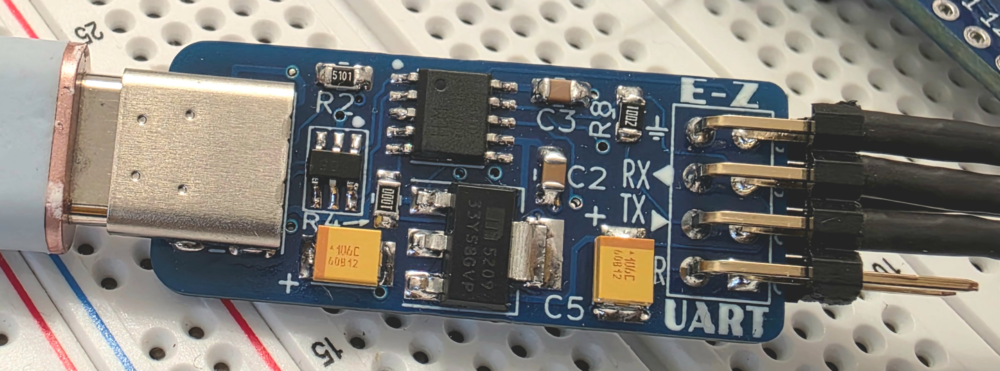
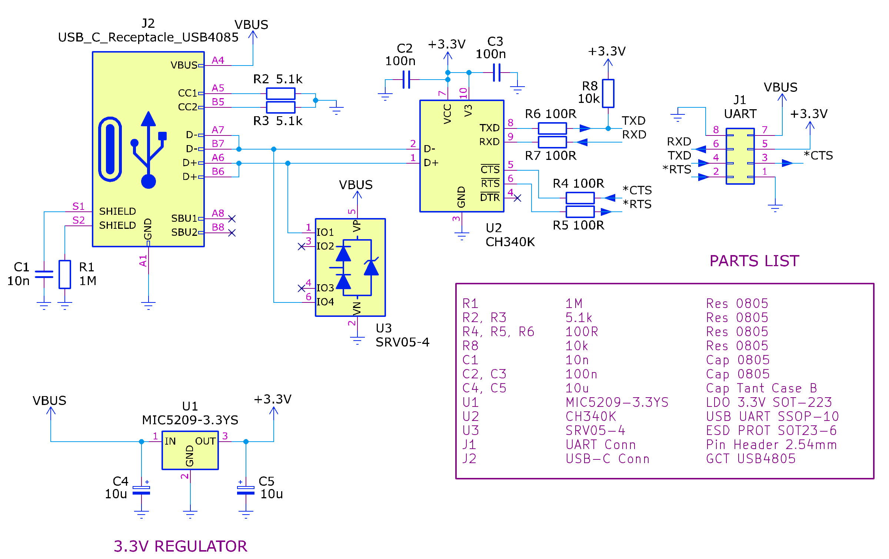
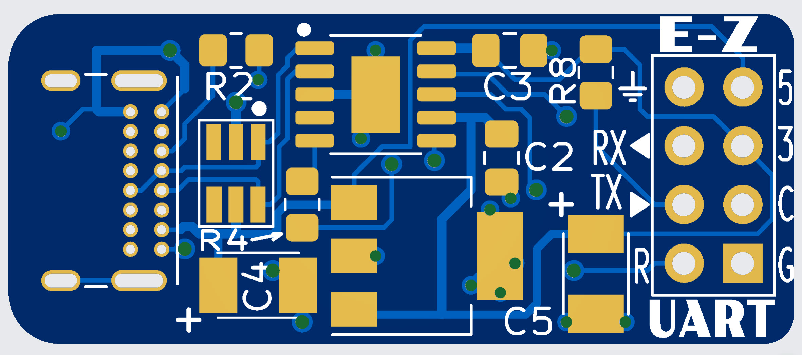

# E-Z UART
This is a simple "USB-C to 3.3V UART" adapter board. It uses the 10-pin CH340K USB-UART integrated circuit. In terms of features, it offers:
* Baud rate to at least 115200 (untested beyond that)
* 3.3V Logic
* 3.3V for powering external circuits (up to around 100 mA)
* RTS and CTS connections if required by the user
* Ultra compact (34 x 14 mm)

To build it, upload the [E-Z UART printed circuit board (PCB) Gerber files](https://github.com/shabaz123/e_z_uart/raw/branch/export-gerbers-ez-uart-rev1.zip) to any PCB manufacturer website.

# Circuit Diagram
See the diagram below for the schematic and parts list. 

# Printed Circuit Board (PCB)
Most of the parts fit on the top side. For the smaller resistors and capacitors, either 0603 or 0805 sized parts will fit.

A few resistors and a capacitor are on the underside.

