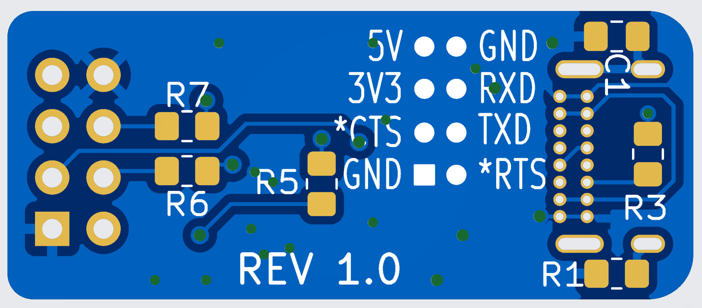

# E-Z UART
This is a simple "USB-C to 3.3V UART" adapter board. It uses the 10-pin CH340K USB-UART integrated circuit. In terms of features, it offers:
* Baud rate to at least 115200 (untested beyond that)
* 3.3V Logic
* 3.3V for powering external circuits (up to around 100 mA)
* RTS and CTS connections if required by the user
* Ultra compact (34 x 14 mm)

# Circuit Diagram
See the diagram below for the schematic and parts list. 

# Printed Circuit Board (PCB)
xyz

